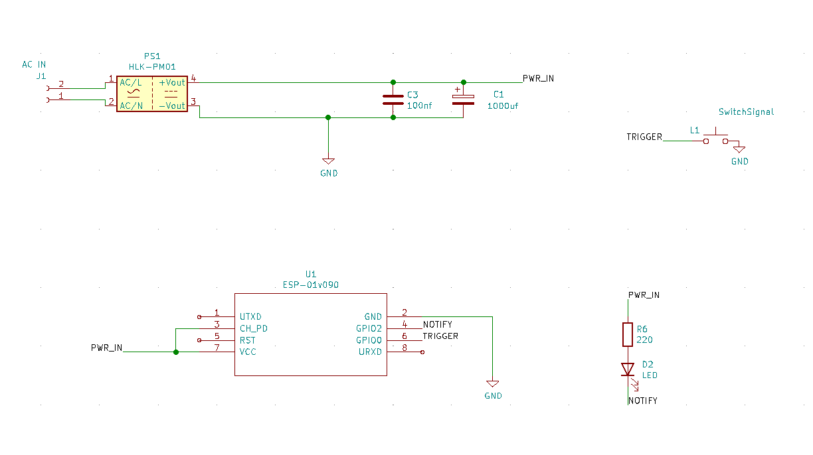

# Switch IoT [AC]

This is a simple switch, just a push button to send a MQTT message. The idea behind it is to create an automation in HASSIO using the MQTT message as a trigger.  

My current prototype testing case is to toggle a Wiz Light Bulb.

----

# How to

1. Set up `config.example` into `config.h` with your settings.
2. Upload the code into an ESP-01

It will use the `BUILTIN_LED` to show the status:

- When connecting to wifi will stay on
- When trigger message will stay on while sending the MQTT message

Schema:

---

Currently I'm building my prototype PCBs so I leave here all the `KiCad` files

---

ROADMAP: Move config.h settings into EEPROM and create wifi network by long-pressing to configure EEPROM
